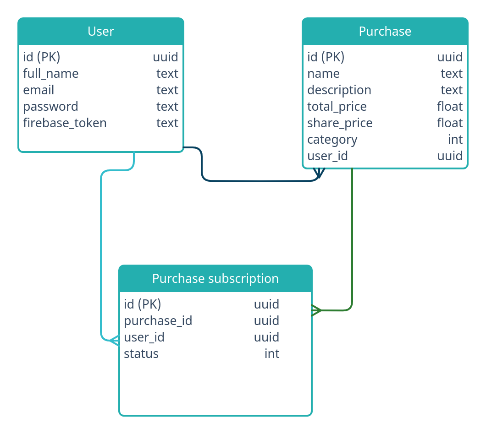

# DB Migrations

## ERD


This repository contains the [Flyway][flyway] migrations used to define house-keeper databases.

## Structure

The migrations are organized into folders according to the database they belong to.

> **Note:** There is a special `init-db` folder which contains migrations that are used on every new database.

Each database folder contains a `flyway.conf` [configuration file][flyway-conf] to configure the migrations.

## General guidelines

The are some general guidelines that are followed in the design of the databases & migrations:

- Permission to create tables is restricted to the DB migrator service account.
- The default `PUBLIC` role is restricted.
- Table-level `SELECT`, `INSERT`, `UPDATE`, and `DELETE` permissions are granted to non-login roles.

### Example simplified permission structure

| Role           | Type            | Connect to database | Create tables | Member of       |
| -------------- | --------------- | ------------------- | ------------- | --------------- |
| postgres       | user (Postgres) | Yes, all            | Yes           | `{superuser}`   |
| db-migrator    | user            | Yes, all            | Yes           | `{}`            |
| api_user       | role            | No                  | No            | `{}`            |
| api_service    | user            | Yes, `{api}`        | No            | `{api_user}`    |

## Running the migrations

In order to run the migrations, you must supply the necessary credentials to connect to the database.

### Locally

1. Make sure your database is running:

```bash
# If postgres is locally installed as a service
sudo systemctl start postgresql
```

```bash
# If postgres is running in a docker container
docker run --name postgres -p 5432:5432 -e POSTGRES_PASSWORD=postgres -d postgres:14.5-alpine
```

2. Copy .env.sample to .env and adjust the values to your needs.
```bash
cp .env.sample .env
```

3. Run the migrations:

```bash
# the -i option will run the init-db migrations before the database specific migrations
export $(cat .env) && ./executor.sh migrate -i -d api
```

### Linting

It use [SQLFluff linter][sqlfluff] to lint and fix our database migrations. The `lint.sh` script will traverse all folders except init-db and will apply lint rules/fixes on any `.sql` files. To run locally:

```bash
$ pip install -r lint-requirements.txt
# install sqlfluff

$ CONCURRENCY=2 bash lint.sh
# will use 2 threads to lint files

$ CONCURRENCY=4 bash lint.sh -f
# will use 4 threads to fix errors
```

The default dialect used is `postgres`.

[flyway]: https://flywaydb.org/
[flyway-conf]: https://flywaydb.org/documentation/configuration/configfile
[sqlfluff]: https://sqlfluff.com/
